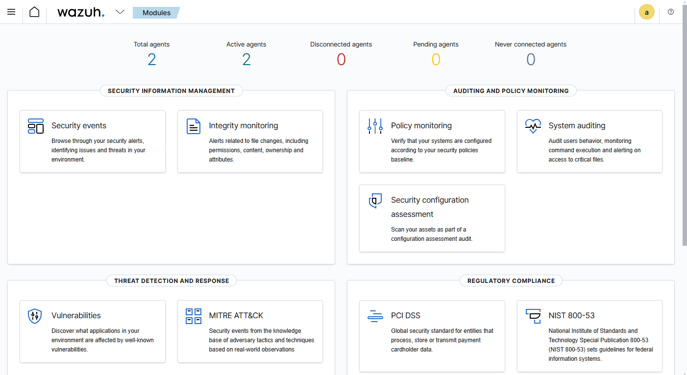
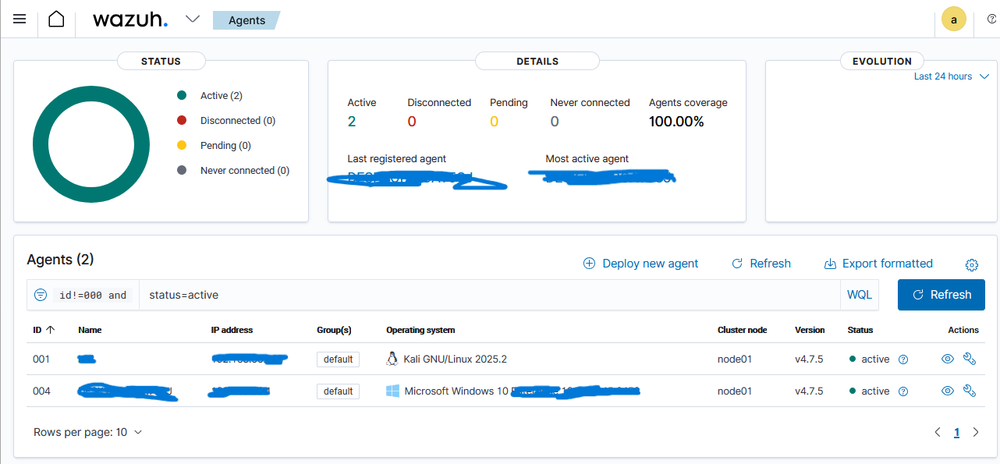
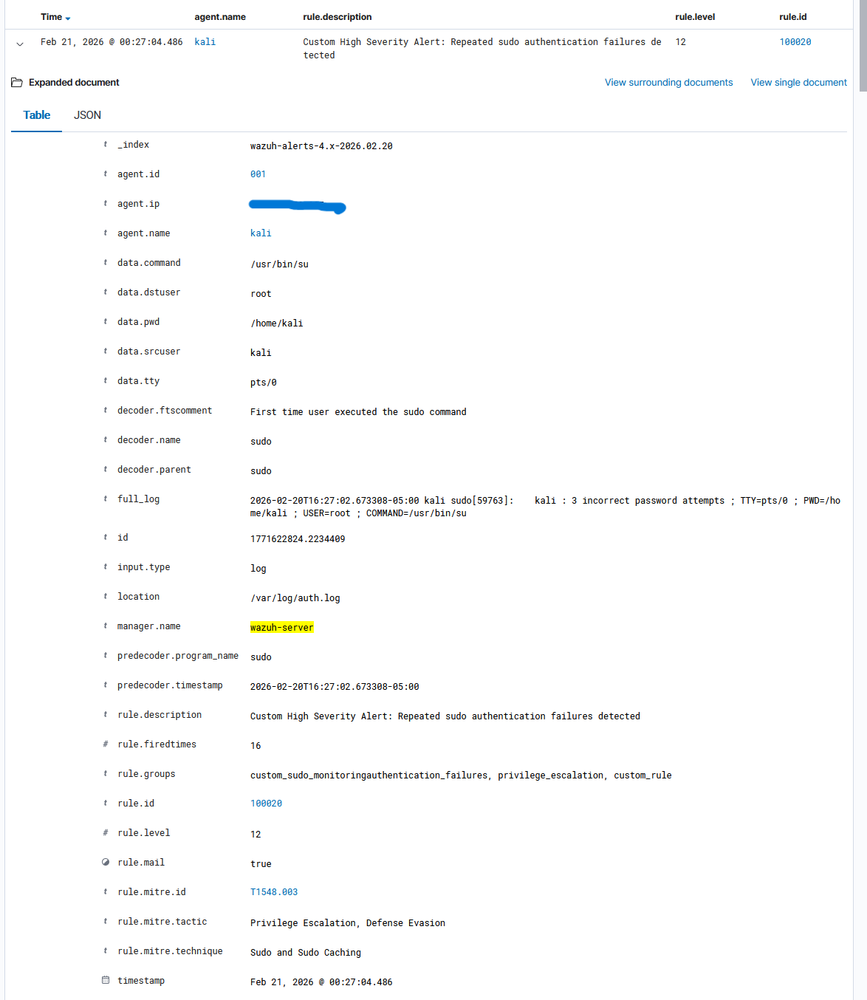
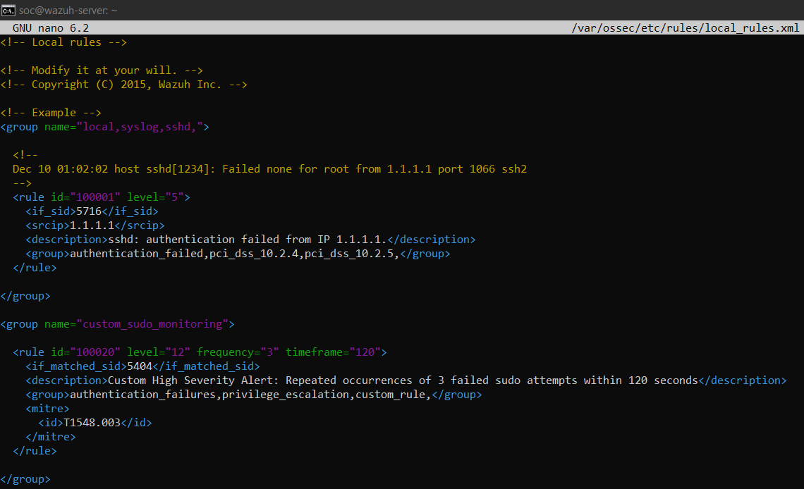

# SOC Level 1 SIEM Detection Lab (Wazuh)

## Project Overview
This project demonstrates the deployment and operation of a SOC-style SIEM environment using **Wazuh Community Edition**.  

The objective was to simulate a real Security Operations Center workflow including log ingestion, detection engineering, alert investigation, and incident escalation.

The lab environment includes Linux and Windows log sources integrated into the SIEM platform.

---

## Technologies Used
- Wazuh SIEM
- Linux (Kali)
- Windows Security Logs
- MITRE ATT&CK Framework
- Virtualized Lab Environment

---

## Detection Use Case
**Scenario:** Repeated sudo authentication failures indicating a potential privilege escalation attempt.

The custom detection rule correlates multiple occurrences of failed sudo authentication events within a defined time window to detect suspicious behavior.

Detection details:

- Base Rule: Wazuh Rule 5404 (Failed sudo authentication)
- Correlation: Multiple occurrences within 120 seconds
- Severity Level: High (12)
- MITRE ATT&CK Mapping:  
  `T1548.003 – Abuse Elevation Control Mechanism: Sudo`

---

## Environment Architecture

SIEM Server:
- Wazuh Manager
- Wazuh Indexer
- Wazuh Dashboard

Log Sources:
- Linux Host (authentication logs)
- Windows Host (security event logs)

---

## Detection Workflow

1. Deploy Wazuh SIEM
2. Integrate Linux and Windows log sources
3. Create custom correlation rule
4. Generate simulated attack activity
5. Trigger SIEM alert
6. Investigate event timeline and log fields
7. Perform SOC-style incident analysis
8. Escalate incident using formal ticket

---

## Investigation Highlights

The investigation included:

- Timeline analysis of correlated authentication failures
- Event field analysis (host, user, command execution)
- Authentication log correlation
- Privileged session verification
- Cross-host anomaly checks
- SSH access history review
- Lateral movement analysis
- IOC validation

---

## Screenshots

### Wazuh Dashboard

### Active Agents

### Event Analysis

### XML Rule File

 
 ---

## Incident Escalation

The incident was documented using a SOC escalation ticket including:

- Incident summary
- Timeline of events
- Evidence collection
- Impact assessment
- Severity justification
- Recommended response actions

---

## Key Learning Outcomes

This project demonstrates practical SOC Level 1 skills including:

- SIEM deployment and configuration
- Log source integration
- Detection rule development
- Event correlation analysis
- False positive validation
- Incident investigation methodology
- Security incident escalation

---

## Repository Structure
SOC-Level1-Wazuh-Detection-Lab
│
├── report/
│   └── README.md
│   └── SOC-Level1-Wazuh-SIEM-Lab.pdf
├── rules/
│   └── sudo-repeated-failures-rule.xml
│
├── screenshots/
│   ├── dashboard.png
│   ├── active-agents.png
│   ├── event-analysis.png
│   └── xml-rule.png
│
├── LICENSE
└── README.md
